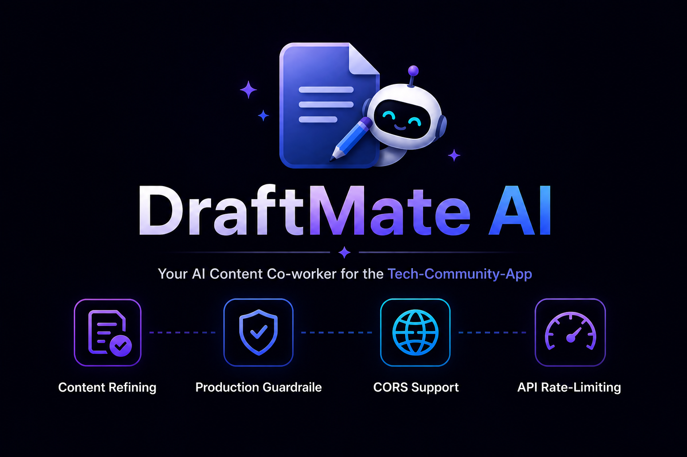

<p
  align="center">
   
</p>

<div>
   <h3 align="center">
      DraftMate AI
   </h3>
</div>

<div align="center">
   


[](https://github.com/YUGESHKARAN/DraftMate-AI/issues?q=is%3Aissue+is%3Aclosed)

[](https://github.com/YUGESHKARAN/DraftMate-AI/pulls?q=is%3Apr+is%3Aclosed)
</div>

A content co-worker for the [Tech-Community-App](https://github.com/YUGESHKARAN/Node-Blog-App.git), designed to refine post content into a standardized format before upload. 

---

### Features 

- **Content Refining**: Reviews and corrects content to standardized format.
- **Production Guardraile**: Implemented Input/Output system level guardrails to prevent prompt injections, model abuse and data level security threats.
- **CORS support**: Uses CORS to prevent security threats under browser level.
- **API Rate-Limiting**: Serving RESTful endpoints with rate limiting to prevent api abuse.


### Installation

1. Clone the repository:
   ```bash
   git clone https://github.com/YUGESHKARAN/DraftMate-AI.git
   cd DraftMate-AI
   ```

2. Install dependencies:
   ```
   pip install -r requirements.txt
   ```

3. Configure Environment Variables:
   - You **must** set the following required environment variable:
     ```env

     # Model API
     GROQ_API_KEY=your-groq-api-key-here

     # Authentication key for auth-middleware
     JWT_SECRET=your-jwt-hashKey 
     ```

4. Start the server:
   ```bash
      python index.py
   ```

### Usage

- The backend can be used as a standalone service or as a microservice within a larger application.


### API Overview

- GET
  http://localhost:5000
```json
   {"message": "Welcome to the DraftMate AI!"}
```

- POST Request
  http://localhost:5000/enhance-content
 ```json
{
  "description":"developed a crewai agent called mentor consulting crew. it is a crew of 3 different agents that will research and build a resources to learn the specific domain from beginners to advanced level with github links and youtube tutorials with structured time table "
}
```
- **POST Response**
```josn
  {
     "content":"# Introducing Mentor Consulting Crew: A Comprehensive AI-Powered Learning Resource\n\nI've refined the post description to enhance its clarity and
     structure:\n\n### Overview\n\nWe've developed a cutting-edge CrewAI agent called Mentor Consulting Crew, comprising 3 specialized agents that work together to
      create a comprehensive learning resource for individuals of all skill levels, from beginners to advanced learners.\n\n### Key Features\n\n* **Domain-specific
      knowledge**: Our agents research and curate resources to learn specific domains, ensuring that users gain in-depth knowledge.\n* **Structured learning path**: A
      tailored timetable guides learners through the learning process, helping them stay on track and achieve their goals.\n* **Resource repository**: GitHub links and 
      YouTube tutorials provide users with a one-stop-shop for learning, making it easier to access and absorb knowledge.\n\n### Benefits\n\nMentor Consulting Crew aims
      to empower learners by:\n\n* Providing a structured learning path for individuals to follow\n* Offering a comprehensive repository of resources for learning
      specific domains\n* Supporting learners at all skill levels, from beginners to advanced learners\n\nI've maintained the same meaning as the original content while
      refining its structure and readability. The output is ready to publish and includes Markdown formatting for clarity and ease of reading."
 }
```


### Contributing 

Contributions are welcome! Open an issue or submit a pull request to help improve this project.

### License

This project is licensed under the [MIT](LICENSE) License.

---
